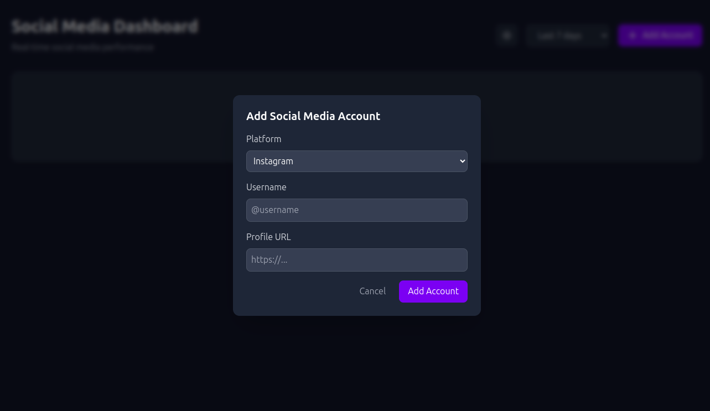
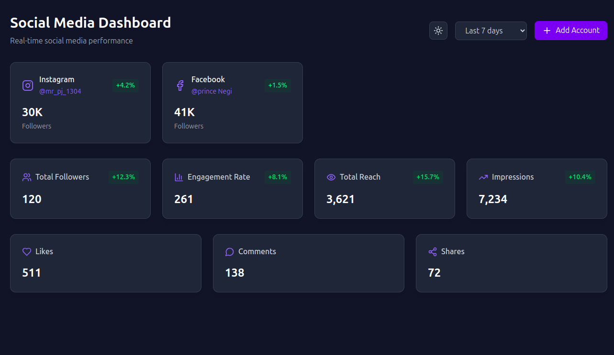

# PjDashConnect

# Live
- link
- https://taskonic.netlify.app/

## Preview 



A modern React dashboard application built with:

- [Vite](https://vitejs.dev/) - Next generation frontend tooling
- [React](https://reactjs.org/) - JavaScript library for building user interfaces
- [TypeScript](https://www.typescriptlang.org/) - Typed JavaScript
- [Tailwind CSS](https://tailwindcss.com/) - Utility-first CSS framework
- [Zustand](https://github.com/pmndrs/zustand) - State management solution

## Getting Started

### Prerequisites
- Node.js (v18 or higher recommended)
- npm (v9 or higher recommended)

### Installation
1. Clone the repository
2. Install dependencies:
```bash
npm install
```

### Available Scripts

- `npm run dev` - Start development server
- `npm run build` - Build for production
- `npm run preview` - Preview production build
- `npm run test` - Run tests

### Development
To start the development server:
```bash
npm run dev
```
Open [http://localhost:5173](http://localhost:5173) to view it in your browser.

### Building for Production
To create a production build:
```bash
npm run build
```
The build artifacts will be stored in the `dist/` directory.

## License
This project is licensed under the MIT License - see the [LICENSE](LICENSE) file for details.
